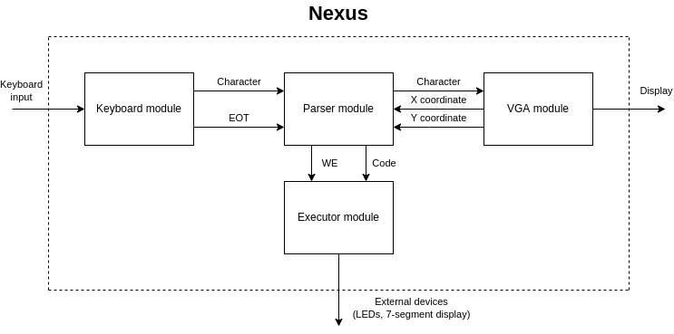

# Nexus

Nexus is an interpreter for a custom programming language, made for Xilinx's Nexys A7 FPGA.


## Design



## Language syntax

The syntax is very simple and supports programming some of Nexys A7's outputs, such as LEDs and 7-segment displays.

Syntax: `[INSTRUCTION] (PARAMETERS)`

### LEDs

Syntax: `LED [id] [state]`
- `state` is either `ON` or `OFF`

Examples:
```
LED 0 ON
LED 1 OFF
```

### RGB LEDs

Syntax: `CLED [id] [state] (color)`
- `state` is either `ON` or `OFF`
- `color` is either `R` (red), `G` (green) or `B` (blue)
- if `color` isn't specified, it defaults to white
- if `state` == `OFF`, the color isn't read

Examples:
```
CLED 0 ON R
CLED 1 ON G
CLED 1 OFF (B)
```

### 7-segment displays

Syntax: `SEG [id] [state] [text]`
- `id` is either 0 or 1, for left (1) or right (0) display
- `state` is either `ON` or `OFF`
- `text` has to be 4 characters long and only include numbers 0-9 and letters A-Z

Examples:
```
SEG 1 ON dead
SEG 0 ON beef
```


## License

The project is licensed under the [MIT license](LICENSE).
