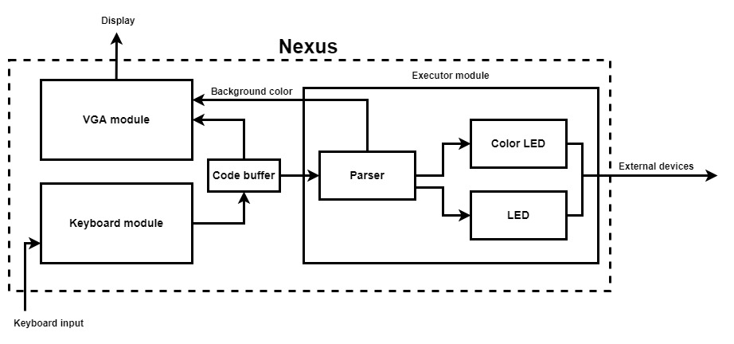

# Nexus

Nexus is an interpreter for a custom programming language, made for Xilinx's Nexys A7 FPGA.


## Design



## Language syntax

The syntax is very simple and supports programming some of Nexys A7's outputs, such as LEDs.

Syntax: `[INSTRUCTION] (PARAMETERS)`

### LEDs

Syntax: `LED [id] [state]`
- `state` is either `ON` or `OFF`

Examples:
```
LED  0 ON
LED  1 OFF
```

### RGB LEDs

Syntax: `CLED [id] [state]`
- `state` is either `ON`, `OFF` or `R` (red), `G` (green), `B` (blue)
- if `state` is `ON`, color is set to white 
- if `state` == `OFF`, led turns off

Examples:
```
CLED 1  G
CLED 0 ON
CLED 1 OFF 
```

## License

The project is licensed under the [MIT license](LICENSE).
